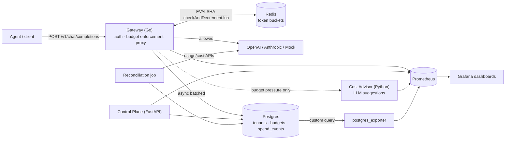

# Budget Governor

A multi-tenant LLM-call gateway that enforces per-tenant, per-agent, and
per-task token/dollar budgets in real time — with an LLM-as-advisor cost
optimizer gated by a deterministic policy engine, a drift-detecting
reconciliation pipeline against provider billing, and a full observability
stack that alerts before the bill arrives, not after.



See [`docs/ARCHITECTURE.md`](docs/ARCHITECTURE.md) for the full design
(including a per-request sequence diagram, failure modes, and scaling
notes), [`docs/DECISIONS.md`](docs/DECISIONS.md) for the engineering
rationale behind every major choice, and
[`docs/BUILD_SUMMARY.md`](docs/BUILD_SUMMARY.md) for exactly what's
been verified versus what's a documented, bounded gap.

## Quickstart

```bash
git clone <this-repo>
cd budget-governor
cp .env.example .env

make up          # docker compose up -d --build: postgres, redis, gateway,
                  # control plane, advisor, reconciliation, prometheus, grafana
make seed        # creates 3 demo tenants/agents/budgets, prints API keys
make smoke       # end-to-end: allowed calls, budget exhaustion, advisor
                  # firing, reconciliation, pass/fail summary
make bench       # k6 fan-out load test: 5,000+ req/s, p50/p95/p99, cost attribution
```

Then open **Grafana** at http://localhost:3000 (`admin`/`admin`) — three
dashboards ("Tenant Overview", "Gateway Health", "Reconciliation Drift")
are already provisioned. Prometheus is at http://localhost:9091.

### Running without API keys

This is the default. Every request whose `model` starts with `mock-`
(and, out of the box, every seeded demo agent) is served by the
deterministic **Mock provider** (`gateway/internal/provider/mock.go`):
realistic variable latency (50–500ms), input-length-dependent token
counts, and real pricing-table-driven cost calculation — with zero
network calls. `ADVISOR_LLM_PROVIDER=mock` (the default) does the same
for the cost advisor, and `reconciliation`'s `MockUsageProvider`
deterministically derives plausible "provider-reported" spend from the
gateway's own observed numbers so the reconciliation pipeline and its
drift-detection alerting have something real to demonstrate. See
`docs/DECISIONS.md`'s ADR-008 and the module docstrings in
`gateway/internal/provider/mock.go`, `advisor/app/llm_client.py`, and
`reconciliation/usage_providers/mock_usage.py` for how each mock is
designed to be realistic rather than a stub.

### Running with real providers

Set in `.env` (see `.env.example` for the full annotated list):

```bash
OPENAI_API_KEY=sk-...
ANTHROPIC_API_KEY=sk-ant-...
```

Any request with `model: "gpt-4o"`, `"claude-sonnet-5"`, etc. is routed
to the real provider automatically (`gateway/internal/proxy/router.go`
selects by model-name prefix — no other config needed). For
reconciliation against real provider billing, also set
`OPENAI_ADMIN_KEY` / `ANTHROPIC_ADMIN_KEY` (organization-scoped admin
keys, distinct from regular inference keys — see
`reconciliation/usage_providers/`). For the advisor to call a real LLM
instead of its deterministic mock, set `ADVISOR_LLM_PROVIDER=openai` or
`anthropic`.

**Before relying on this for real budget decisions**, re-verify the
pricing tables (`gateway/internal/provider/pricing.go`,
`providers/pricing.py`) against each provider's current pricing page —
they're dated (verification date in the file header), not live-fetched,
by design.

## Repo layout

| Path | What |
|---|---|
| `gateway/` | Go hot path: auth, budget enforcement, provider proxy, streaming, policy engine |
| `controlplane/` | Python/FastAPI: tenants, agents, API keys, budgets, spend queries, incidents |
| `advisor/` | Python/FastAPI: the LLM-as-advisor cost optimizer |
| `reconciliation/` | Python: scheduled drift detection vs. provider billing |
| `providers/` | Shared pricing table (Python), used by advisor + reconciliation |
| `migrations/` | Shared SQL schema, applied by `scripts/migrate.py` |
| `observability/` | Prometheus scrape configs + alert rules, Grafana dashboards |
| `loadtest/` | k6 load test scripts |
| `scripts/` | seed / smoke / benchmark / migrate |
| `deploy/` | `docker-compose.yml` |
| `docs/` | Architecture, decisions, runbook, resume-bullet map, build summary |

## The five resume bullets, and where they live

1. **"Designed and implemented a multi-tenant LLM-call gateway enforcing
   per-tenant, per-agent, and per-task token budgets with sub-10ms p99
   overhead."** → `gateway/internal/budget/`, `gateway/internal/auth/`,
   proven by `loadtest/fanout_burst.js` via `make bench`.
2. **"Built a distributed token-bucket enforcement layer validated under
   5,000+ req/sec simulated agent fan-out load."** →
   `gateway/internal/budget/checkAndDecrement.lua`, concurrency-tested in
   `bucket_test.go`, load-tested in `loadtest/fanout_burst.js`.
3. **"Implemented a reconciliation pipeline comparing gateway-observed
   spend against provider billing APIs, detecting and correcting
   drift."** → `reconciliation/job.py`, `reconciliation/usage_providers/`.
4. **"Designed an LLM-as-advisor cost-optimization feature with a
   deterministic policy engine gating all decisions."** → `advisor/app/`
   + `gateway/internal/policy/` (the actual decision-maker).
5. **"Shipped a full observability stack ... with alerts that fire
   before overspend, not after the bill."** →
   `gateway/internal/observability/`, `observability/prometheus/alerts.yml`
   (see `BurnRateHigh`), `observability/grafana/dashboards/`.

Full detail, with exact file/line-level pointers per bullet, in
[`docs/RESUME_BULLETS.md`](docs/RESUME_BULLETS.md).

## License

[MIT](LICENSE)
