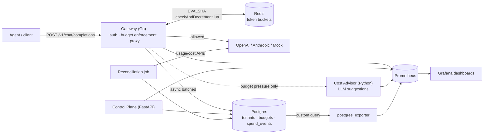

# Budget Governor

Budget Governor sits between your AI agents and the LLM providers they call
(OpenAI, Anthropic) and stops them from spending more money than you allowed.

Every request goes through it first. It checks how much budget the tenant,
the agent, and the task have left. If there is enough, it forwards the call
and records what was actually spent. If there is not, it blocks the call and
returns a 429 instead of letting the bill grow.

It also:

* suggests cheaper ways to make the call when a budget is running low
* compares its own spend numbers against the provider's billing API to catch
  drift
* ships dashboards and alerts that warn you while you are overspending, not
  after the invoice arrives

## How it fits together



In words:

1. **Gateway (Go)** is the piece on the request path. It checks the API key,
   estimates the cost, asks Redis whether there is budget left, forwards the
   call to the provider, and writes the real cost down afterwards.
2. **Redis** holds the token buckets. A small Lua script does the
   check-and-subtract in one atomic step, so many gateway instances can share
   the same budget safely.
3. **Postgres** is the system of record: tenants, agents, keys, budgets, and
   one row per call in `spend_events`.
4. **Control plane (FastAPI)** is the admin API where you create tenants,
   agents, API keys, and budgets, and where you query spend.
5. **Cost advisor (Python)** is only called when a request is about to be
   throttled. It asks an LLM for cheaper alternatives. Its answers are
   suggestions only. A deterministic policy engine in the gateway decides
   what actually happens, so an LLM never gets to approve spending.
6. **Reconciliation job (Python)** runs on a schedule, pulls the provider's
   own usage and cost numbers, compares them to what the gateway recorded,
   and files an incident if the gap is too big.
7. **Prometheus and Grafana** collect the metrics and show three
   pre-built dashboards, plus burn-rate and drift alerts.

## Quickstart

```bash
git clone <this-repo>
cd budget-governor
cp .env.example .env

make up          # start everything with docker compose
make seed        # create 3 demo tenants/agents/budgets, print their API keys
make smoke       # run an end-to-end check and print pass/fail
make demo        # walk one agent through allow, throttle, reroute, spend
make bench       # k6 load test: 5,000+ req/s, p50/p95/p99, cost attribution
```

Then open **Grafana** at http://localhost:3000 (`admin` / `admin`). The
"Tenant Overview", "Gateway Health", and "Reconciliation Drift" dashboards
are already set up. Prometheus is at http://localhost:9091.

Other useful targets: `make down`, `make logs`, `make test`.

## You do not need API keys to try it

Running without provider keys is the default, and it still does something
real. Any request whose `model` starts with `mock-` (which includes every
seeded demo agent) is handled by a built-in mock provider with variable
latency of 50 to 500ms, token counts that depend on input length, and cost
math driven by the real pricing table. No network calls happen.

The other two mocks work the same way. `ADVISOR_LLM_PROVIDER=mock` (the
default) gives the advisor canned but sensible suggestions, and the
reconciliation job's `MockUsageProvider` derives plausible
"provider-reported" spend from the gateway's own numbers so drift detection
has something to detect.

The relevant files are `gateway/internal/provider/mock.go`,
`advisor/app/llm_client.py`, and
`reconciliation/usage_providers/mock_usage.py`. ADR-008 in
`docs/DECISIONS.md` explains why the mocks are realistic rather than stubs.

## Using real providers

Put your keys in `.env` (`.env.example` lists every option with comments):

```bash
OPENAI_API_KEY=sk-...
ANTHROPIC_API_KEY=sk-ant-...
```

Routing is automatic. A request for `gpt-4o` or `claude-sonnet-5` goes to the
matching provider because `gateway/internal/proxy/router.go` picks by model
name prefix. There is nothing else to configure.

Two extras, if you want them:

* To reconcile against real billing, also set `OPENAI_ADMIN_KEY` and
  `ANTHROPIC_ADMIN_KEY`. These are organization-scoped admin keys, which are
  not the same as your normal inference keys. See
  `reconciliation/usage_providers/`.
* To let the advisor call a real LLM, set `ADVISOR_LLM_PROVIDER=openai` or
  `anthropic`.

> **Check the prices before trusting this with real money.** The pricing
> tables in `gateway/internal/provider/pricing.go` and `providers/pricing.py`
> are hand-maintained and dated in the file header, not fetched live. That is
> deliberate, but it means you should compare them against each provider's
> current pricing page first.

## Repo layout

| Path | What is in it |
|---|---|
| `gateway/` | Go request path: auth, budget enforcement, provider proxy, streaming, policy engine |
| `controlplane/` | Python/FastAPI admin API: tenants, agents, API keys, budgets, spend queries, incidents |
| `advisor/` | Python/FastAPI cost optimizer that suggests cheaper calls |
| `reconciliation/` | Python scheduled job that compares spend against provider billing |
| `providers/` | Shared pricing table (Python), used by the advisor and reconciliation |
| `migrations/` | Shared SQL schema, applied by `scripts/migrate.py` |
| `observability/` | Prometheus scrape configs and alert rules, Grafana dashboards |
| `loadtest/` | k6 load test scripts |
| `scripts/` | seed / smoke / benchmark / migrate |
| `deploy/` | `docker-compose.yml` |
| `docs/` | Architecture, decisions, runbook |

## Docs

* [`docs/ARCHITECTURE.md`](docs/ARCHITECTURE.md): the full design, with a
  per-request sequence diagram, failure modes, and scaling notes.
* [`docs/DECISIONS.md`](docs/DECISIONS.md): why each major choice was made.
* [`docs/RUNBOOK.md`](docs/RUNBOOK.md): operating it.

## Where to look

* **Budget enforcement:** `gateway/internal/budget/` and the Lua script
  `checkAndDecrement.lua`. Concurrency tests are in `bucket_test.go`; load
  tests are in `loadtest/fanout_burst.js` (`make bench`).
* **Auth:** `gateway/internal/auth/` on the request path,
  `controlplane/app/auth/` for the admin API.
* **Advisor and policy:** `advisor/app/` makes suggestions,
  `gateway/internal/policy/` decides.
* **Reconciliation:** `reconciliation/job.py` and
  `reconciliation/usage_providers/`.
* **Alerts and dashboards:** `observability/prometheus/alerts.yml` (see
  `BurnRateHigh`) and `observability/grafana/dashboards/`.

## License

[MIT](LICENSE)
