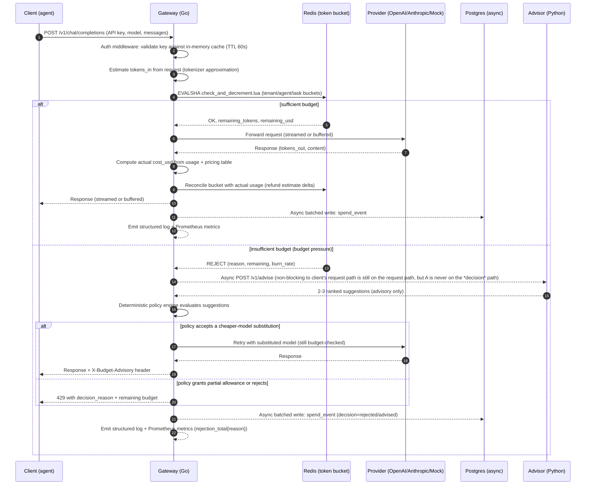

# Architecture

Budget Governor is a multi-tenant LLM-call gateway that enforces per-tenant,
per-agent, and per-task token/dollar budgets in real time, with an
LLM-as-advisor cost-optimization feature that fires only under budget
pressure, gated by a deterministic policy engine, and a full observability
stack that alerts *before* the bill arrives.

## Components

| Component | Language | Role |
|---|---|---|
| **gateway** | Go | Hot path. Terminates client requests, authenticates them, enforces budgets in Redis, proxies to the upstream LLM provider (or the mock provider), streams the response back, emits metrics/logs, writes spend events asynchronously. |
| **controlplane** | Python / FastAPI | Management API: tenants, agents, API keys, budget CRUD, spend queries, incident listing. System of record lives in Postgres. |
| **advisor** | Python / FastAPI | Called by the gateway only when a request is about to be throttled or rejected. Calls an LLM (or the mock provider) for ranked cost-reduction suggestions, validates the response against a strict schema, and returns structured, *advisory* suggestions. Never makes the accept/reject decision itself. |
| **reconciliation** | Python (scheduled job) | Periodically compares gateway-observed spend (Postgres `spend_events`) against provider-reported billing (OpenAI/Anthropic usage & costs APIs), detects drift beyond a configurable threshold, and records incidents. |
| **Redis** | — | Distributed token-bucket state for budget enforcement. Atomic check-and-decrement via Lua scripts. Sole synchronous dependency on the gateway hot path. |
| **Postgres** | — | System of record: tenants, agents, API keys, budget configuration, spend events (append-only, written async by the gateway), reconciliation runs/drift, incidents. |
| **Prometheus / Grafana** | — | Metrics scraping, dashboards, burn-rate and drift alerting. |

## Data flow: a single LLM call

Note: the advisor call happens only after the deterministic bucket check has
already failed. It is on the *response* path for that one throttled request
(the client is waiting for a final answer either way), but it is never
consulted for the accept/reject decision on the 99%+ of requests that are
within budget, and the policy engine — not the LLM — makes the final call
even when the advisor is consulted. This keeps the advisor entirely off the
sub-10ms hot path.

## Budget enforcement hierarchy

A request is checked against up to three nested buckets, most specific first:

1. **task** bucket (if `task_id` is supplied and a task-level budget exists)
2. **agent** bucket (per `agent_id` within a tenant)
3. **tenant** bucket (the tenant-wide ceiling)

Each bucket is a Redis hash keyed `budget:{tenant_id}:{agent_id|-}:{task_id|-}`
holding `tokens_remaining`, `usd_remaining`, `last_refill_ts`. Refill is
computed lazily inside the Lua script (no background refill workers, no
clock-drift issues): `tokens_remaining = min(limit, tokens_remaining +
elapsed_seconds * refill_rate_per_sec)`.

A single Lua script (`checkAndDecrement.lua`) evaluates all applicable
buckets in one atomic round trip, so a request either passes all three
checks and decrements all three buckets, or fails at the first insufficient
bucket and decrements nothing. This makes the enforcement layer
linearizable per Redis's single-threaded script execution — there is no
race window across concurrent requests for the same tenant/agent/task,
which is what the load test in `loadtest/fanout_burst.js` is designed to
prove at 5,000+ req/s of simulated fan-out.

## Hot-path latency budget

The ≤10ms p99 target is a hard constraint on the gateway process only
(excludes upstream provider latency, which is unbounded and irrelevant to
what we control). Within the gateway:

- **Auth**: in-memory LRU cache of `hashed_key -> {tenant_id, scopes}`,
  refreshed from Postgres by a background goroutine every 60s, or lazily on
  cache miss (rare — only on first use of a new key or after rotation).
  No synchronous DB call on the common path.
- **Budget check**: one Redis round trip running one Lua script
  (`EVALSHA`, pre-loaded at startup). Typically <1ms against a local/
  same-AZ Redis.
- **Spend recording**: buffered in an in-process channel and flushed to
  Postgres in batches (default: every 200ms or 500 events, whichever
  first) by a dedicated writer goroutine. The request path never blocks on
  this write.
- **Logging**: structured JSON lines written to stdout via a buffered,
  asynchronous `slog` handler; never a synchronous network log shipper on
  the request path.
- **Metrics**: Prometheus client library counters/histograms are
  in-memory atomic operations; scraped by Prometheus on its own pull
  schedule, not pushed synchronously.
- **Advisor**: only invoked on the failure branch (budget pressure),
  which by definition is not part of the steady-state hot path being
  measured for the p99 claim; the benchmark script reports both the
  "allowed request" p99 (the headline number) and the "advised/rejected
  request" latency separately.

## Failure modes and handling

| Failure | Behavior |
|---|---|
| Redis unavailable | Gateway fails **closed** for budget checks (returns 503 `budget_backend_unavailable`) rather than allowing unmetered spend — a stuck Redis is safer than an unbounded bill. Circuit breaker trips after N consecutive errors and short-circuits to 503 without waiting out the connection timeout, protecting the p99. |
| Postgres unavailable (spend write) | Spend events buffer in memory up to a bounded queue; on overflow, oldest events are dropped and a `spend_write_dropped_total` counter increments (visible in Grafana). Auth cache keeps serving from its last-known-good snapshot. The request path is unaffected either way — this is why writes are async. |
| Provider unavailable / 5xx / timeout | Gateway retries once with jittered backoff (bounded, since it *is* on the client's response path), then returns a normalized `502 upstream_error` with the provider's error body attached. Tokens are not decremented for a failed upstream call once we know it failed *if* the failure occurred before any tokens were generated (we know the provider's own usage accounting semantics from the response shape). If the upstream call partially streamed before failing, tokens observed so far are charged (see `internal/provider`). |
| Advisor unavailable / times out | Bounded 300ms timeout; on failure the policy engine treats it as "no suggestions" and falls back to its deterministic default (typically a hard reject with a clear reason) — the advisor's absence never blocks a decision indefinitely. |
| Reconciliation job finds provider API unavailable | Run is marked `completed_at IS NULL, drift_detected=false` with a logged error; it is retried on the next scheduled invocation rather than partially reconciling. |
| Clock skew across gateway replicas | Refill math uses Redis server time (`TIME` command result threaded into the Lua script), not each gateway replica's local clock, so replica clock drift cannot cause double-refill. |

## Scaling considerations

- **Gateway**: stateless, horizontally scalable behind a load balancer;
  all shared state lives in Redis/Postgres. Redis is the eventual
  bottleneck at very high fan-out; the Lua script keeps each check O(1)
  and single-round-trip, and Redis Cluster (sharded by `tenant_id` prefix
  in the key) is the documented path past a single Redis node's ceiling
  (see `docs/DECISIONS.md`).
- **Control plane**: read-heavy (spend queries); the `spend_events` table
  is indexed on `(tenant_id, created_at)` and is a natural candidate for
  monthly partitioning once volume warrants it (not implemented in this
  build — noted as a follow-up in `docs/BUILD_SUMMARY.md`).
- **Advisor**: stateless, called at low volume by construction (only on
  budget pressure), so it is not a scaling concern in practice.
- **Reconciliation**: scheduled, batch-oriented; scales by time-window
  partitioning if tenant count grows large.

## Multi-tenancy and auth

Every API key is scoped to exactly one tenant and carries one or more
scopes (`admin`, `agent`, `viewer`). Keys are generated as
`bg_live_<32 random bytes, base62>`, stored in Postgres only as a bcrypt
hash (never in plaintext after issuance), and looked up by a deterministic
prefix index (`key_prefix`, the first 12 chars) to avoid a full-table
bcrypt scan on every auth check — the prefix narrows to (usually) one row,
which is then bcrypt-verified. See `docs/DECISIONS.md` for why this is API
keys + scopes rather than OAuth2/JWT.
